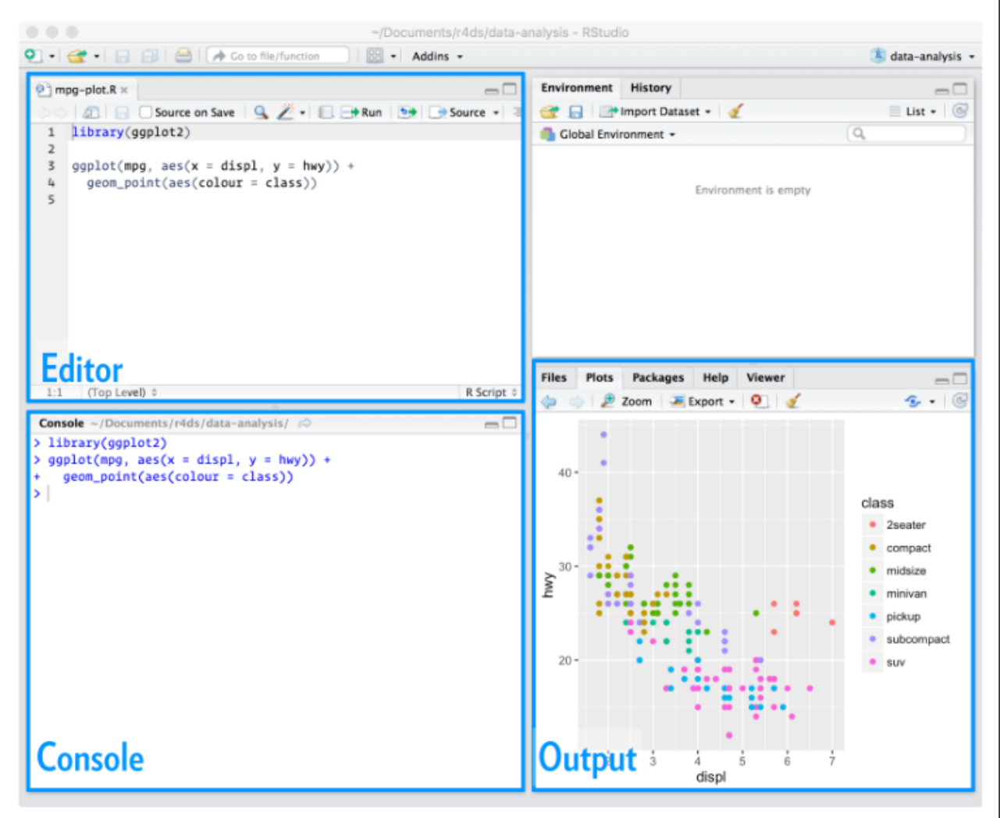
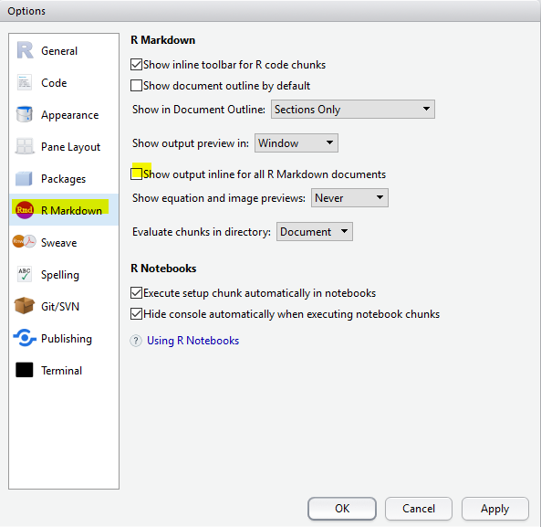
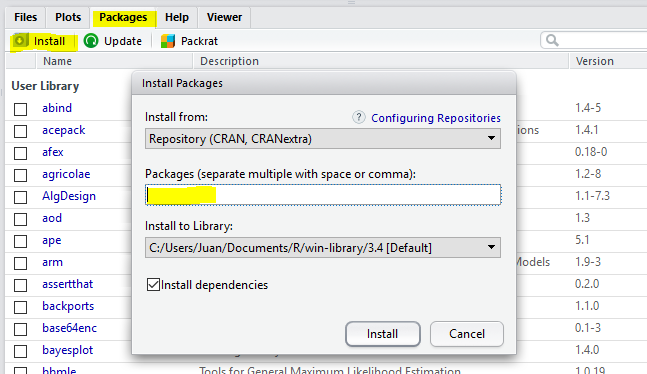
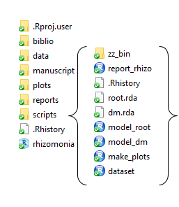

```{r include=FALSE}
library(knitr)
library(kableExtra)
opts_chunk$set(echo = TRUE, 
               warning = FALSE, 
               message = FALSE, 
               eval=FALSE)
options(width = 90)
#http://happygitwithr.com/bookdown-cheat-sheet.html
```

# Configuraciones básicas {#config}

<b>Instalación de programas</b>

1° [R](https://cran.r-project.org/) 

2° [R Studio](https://www.rstudio.com/products/rstudio/download/) (bajar la versión Free)

```{r, echo=FALSE, eval=TRUE, fig.align='center'}

```

RStudio es un entorno de desarrollo integrado (IDE) para el lenguaje de programación R, o sea es la interface por medio de la cual se ejecutan acciones en R. 

Configuraciones iniciales (sugeridas). Dirigirse a la sección "Tools/Global options"

<center>



</center>


## Paquetes de R {-}

Un paquete es una colección de funciones, datos y código R que se almacenan en una carpeta conforme a una estructura bien definida, fácilmente accesible para R. Hay paquetes oficiales (disponibles en CRAN) y no oficiales (disponibles a través de plataformas como github). A la fecha (febrero de 2019) hay 13753 paquetes oficiales.

La simple instalación de R trae consigo múltiples paquetes que permiten un funcionamiento básico de importación de datos, ajuste y evaluación de modelos estadísticos y representaciones gráficas. Sin embargo, la enorme potencia de R deriva de su capacidad de incorporar nuevas funciones generadas por su gran comunidad de usuarios (ver novedades en:
[r weekly](https://rweekly.org/); 
[r-bloggers](https://www.r-bloggers.com/);
[revolution analytics](https://blog.revolutionanalytics.com/); 
[RStudio blog](https://blog.rstudio.com/categories/packages)) 

En la web de R se puede consultar la [lista de paquetes disponibles](https://cran.r-project.org/web/packages/available_packages_by_date.html), y en la sección [Task Views](https://cran.r-project.org/web/views/) se puede consultar los mismos ordenados por áreas de aplicación.

Existen varias vias de instalación de paquetes:

</br>

<center>
 
</center>

</br>

- Via CRAN (Comprehensive R Archive Network): `install.packages("nombre_del_paquete")` O simplemente en el panel de paquetes.  
- Paquetes no oficiales via Github: `devtools::install_github("rstudio/epiphy")` 
</br>

```{block, type='rmdcomment'}
Una vez instalado, hay que cargar los paquetes que contienen las funciones que vayamos a usar en cada sesión
```

`library(nombre-del-paquete)`

## Workflow componentes {-}

Varios tipos de archivos serán creados y usados durante una sesión de R: 

* datos crudos (hojas de cálculo) - datos manipulados
* scripts
* gráficos
* reportes de resultados

Una sesión de análisis debe poder ser retomada en cualquier momento pudiendo darse por concluída cuando el trabajo es publicado. Hasta entonces debemos tener rápido acceso a todos los objetos creados en sesiones anteriores. Para ello debemos manejarnos siempre bajo *buenas prácticas* de trabajo. Esto nos permitirá entender qué quisimos hacer tiempo atrás, seremos intuitivos para encontrar archivos/objetos, y finalmente crearemos trabajos *reproducibles*...   
Una forma práctica de administrar todos los objetos que una sesión es crear un proyecto de R para cada sesión. 

 

Una sugerencia es generar subcarpetas en nuestras máquinas, en preferencia dentro de dropbox / google drive. Esto no sólo mantendrá nuestro trabajo resguardado de posibles pérdidas (backup), retomarlo desde diferentes áquinas (trabajo/casa), sino que también le permitirá compartir en tiempo real sus avances con los colaboradores de su trabajo.

<center>
 
</center>

> Crear una carpeta Intro_R en sus máquinas

> Crear una nuevo proyecto "Intro_R.Rproj"

> Crear un script "1_intro"

¿Dónde se guardaria el siguiente gráfico?

```{r}
plot(pressure)
```

## S.O.S. {-}

- En el mismo R: `?auc`;  `??auc`; F1 sobre la función 

- Googlear: “r generate a sequence of uppercase letters”  

- **Stack Overflow**: foros de preguntas y respuestas ampliamente utilizados por todos los lenguajes de programación. En algunos países, llegan hasta a usar la reputación de los usuarios como diferencial en el currículum!

**¿Cómo hacer una buena pregunta en el stack overflow?**

- Ser conciso pero gentil...

- Ser reproducible: su código debe correr en cualquier máquina. La comunidad no irá a ayudarle si no pueden reproducir su error (detallar paquetes y versión de R en caso necesario) `library(reprex)`. 
