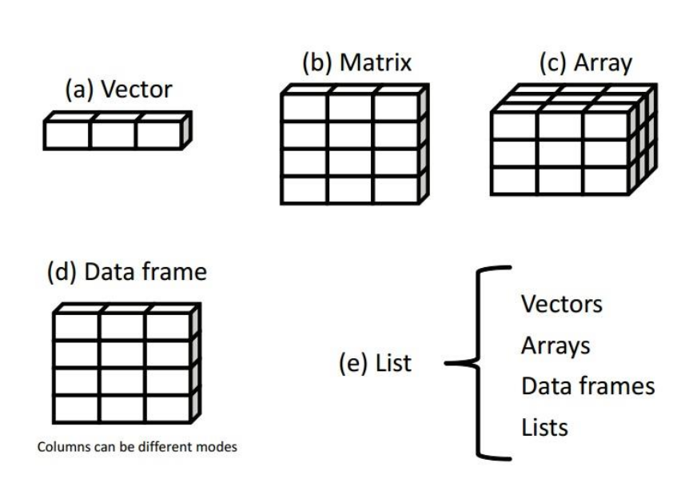

```{r include=FALSE}
library(knitr)
opts_chunk$set(echo = TRUE, 
                      warning = FALSE, 
                      message = FALSE, 
                      eval=FALSE)

options(width = 90)

#http://happygitwithr.com/bookdown-cheat-sheet.html
library(kableExtra)
```

# Introducción {#intro}

## Instalación de programas

1° [R](https://cran.r-project.org/) 

2° [R studio](https://www.rstudio.com/products/rstudio/download/) (bajar la versión Free)

```{r, echo=FALSE, eval=TRUE, fig.cap="Paneles de RStudio", fig.align='center'}
knitr::include_graphics("fig/rstudio.png")
```

## Instalación de paquetes 

Existen varias vias de instalación de paquetes:

- Via CRAN (Comprehensive R Archive Network): `install.packages("nombre_del_paquete")` O simplemente en el panel de paquetes.  

- Paquetes no oficiales via Github: `devtools::install_github("rstudio/shiny")` 

```{r}
install.packages(c("tidyverse", "agricolae"))
```

Una vez instalado, hay que cargar los paquetes que contienen las funciones que vayamos a usar en cada sesión:

`library(nombre-del-paquete)`

## Configuración de la sesión

Un punto fundamental de cada sesión es saber cual es el **directorio de trabajo**, que por default se configurará en el disco "C:/...documentos", por lo tanto siempre tenemos que relocalizar nuestras carpetas de trabajo. 

Una forma de averiguar el actual directorio de trabajo es tipear en la consola `getwd()`, o bien en el panel de outputs, en la primer pestaña de la izquierda tendremos abierta esa carpeta donde está indicada el directorio de trabajo. 

Para indicar cual será nuestro directorio de trabajo usamos el atajo **Ctrl + Shift + h** y seleccionamos manualmente la carpeta.  

Varios tipos de archivos serán usados/creados durante una sesión: 

* datos (hojas de cálculo)
* scripts
* gráficos
* reportes de resultados

Estos objetos deben estar bien organizados en subcarpetas para su rápido acceso y retome de trabajo en cualquier instante, en preferencia dentro de dropbox / google drive. Esto no solo mantendrá resguardado de posibles pérdidas (backup) sino que también le permitirá compartir en tiempo real sus avances con los colaboradores de su trabajo.

Como dijimos, una sesión de análisis debe poder ser retomada en cualquier momento pudiendo darse por  concluída cuando el trabajo es publicado. Hasta entonces debemos tener rápido acceso a todos los objetos creados en sesiones anteriores. 

> Crear una sesión en sus computadoras

> Crear un script 

```{r}
getwd() 
setwd("C:\Usuario\Documentos\Curso") # Calma! Ctrl + Shift + h
getwd() 
```

Donde se guardaria el siguiente gráfico?

```{r}
plot(pressure, type = 'b', pch = 19)
```


## R como calculadora 

Ver [tablas resumen](#tablas_resumen) de operadores aritméticos y lógicos (al final del capítulo) 

```{r, eval=FALSE}
4 + 9
4 - 
  3 *
  1
# 4%1
4>3
4 == 3
4 == 4

(4 + 5 ) * 7 - (36/18)^3
```

> Está bien la siguiente expresión? `5 + 3 * 10 %/% 3 == 15` 
Agregue parentesis para que la expresión de un resultado contrario.

<div style= "float:right;position: relative; top: 0px;">
```{r echo=FALSE, eval=TRUE, out.width = '70%', fig.align='right'}
knitr::include_graphics("fig/fhb.jpg")
```
</div>

Ej: **Rendimiento de trigo en función de la severidad de fusariosis de la espiga** _"The estimated linear regression intercept (expected wheat yield when disease symptoms were not present) was 4.10 MT/ha, and the slope was 0.038 MT/ha per unit increase of disease index. Wheat class had a significant effect on the intercept but not on the slope, with soft-red winter wheat having, on average, 0.85 MT/ha higher yield than spring wheat"_     

i) Cuanto seria el rendimiento de ambas variedades de trigo con 1, 10 o 20% de severidad de la enfermedad?

```{r}
4.1 - 0.038 * 10
(1-(3.72/4.1))*100
```

Algunos cálculos

```{r}
sqrt(3) # 3^0.5
2^(1/3) # ^(1/n)
log(10)
log(10, base=10)
exp(1)
log(10, base=exp(1))
exp(4)
log10(10^4)

round(4.3478, digits=3)  # ceiling(4.3478) floor(4.3478)
```

(Note que R está en inglês (decimales “.”, nombre de las funciones)
y es “case sensitive”!!)

## Tipos de Objetos 

 

```{r}
atom <- 3
atom
```

El anterior ejemplo, guardamos el valor 3 en "atom", y siempre que R encuentre ese nombre atom lo entenderá como un 3.

Existen varias **clases** básicas o “atómicas” de elementos en R

```{r}
class(atom)
```

### Vectores

```{r}
# concatenación de elementos atómicos
v <- c(8, 7, 9, 10, 10, 111)
class(v)

(b <- c("A", "b"))
class(b)
is.character(b)
is.numeric(b)

(m <- c(TRUE, FALSE, T, F)) ; class(m)

# Propiedades de v
# ?length
length(v)  
summary(v) 
#v <- edit(v)
sort(v)
```

* Operaciones com vectores

```{r, eval=FALSE}
v - 1

# Medidas de posición
mean(v) 
median(v)

# Medidas de dispersión
var(v)
sd(v)
sqrt(var(v))

IQR(v)
range(v)

quantile(v, 0.1)
max(v)
min(v)
sum(v)
```

> Crie tres nuevos vectores que sean: i) la potencia cuadrada de 3.5 de v; ii) la raiz cubica de v; iii) el logaritmo natural de la diferencia de i) y ii)

* Secuencia

```{r, eval=FALSE}
1:7  
seq(from = 0, to = 20, #by=2) # 
 length=4) 

rep(1:3, times=3) #  , each=3   
```

* Números aleatorios - distribuciones

```{r, eval=FALSE}
a = rnorm(100, mean=3, sd=2) 
range(a)
hist(a)
hist(a, prob=TRUE)
lines(density(a), col="blue", lwd=2) # add a density estimate with defaults
plot(a)
plot(cumsum(a))
boxplot(a)

b = runif(100) # 
hist(b)
```


* Propiedades de vectores 

Si colocaramos dos o mas clases diferentes dentro de un mismo vector, R va forzar a que todos los elementos pasen a pertenecer a una misma clase. El número 1.7 cambiaria a  "1.7" se fuera creado junto con "a".

```{r, eval=FALSE}
y <- c(1.7, "a")  ## character
y <- c(TRUE, 2)   ## numeric
y <- c(TRUE, "a") ## character
```

Forzando las clases explicitamente

`as.character(), as.numeric(), as.integer() e as.logical()`

* Factores

Factores pueden ser considerados como vectores de enteros que poseen rótulos (labels).

```{r, eval=FALSE}
resist <- c("R", "S", "S", "S", "R")
class(resist)
res_f <- as.factor(resist)
res_f
as.numeric(res_f)

table(resist)
pie(table(resist))
barplot(table(resist))
```

De factor para numérico

```{r, eval=FALSE}
niv_res <- factor(c("1", "5", "7", "9"))
sum(niv_res)
niv_res1 = as.numeric(niv_res)
mean(niv_res1)
niv_res2 = as.numeric(as.character(niv_res))
mean(niv_res2)
```

* Indexación

```{r}
y[ ]
y[2]
y[1:3]
```

> selecione os elementos 1° e 3°

* Condición

```{r}
# ifelse(condición, valor_si_TRUE, valor_si_FALSE)
ifelse(a<2, "Low", "High")
```

> Se evaluaron 10 clones de porta-injertos de cítricos según su resistencia a Gomosis del Tronco (Phytophthora parasitica). Los diámetros de la lesión (cm) en el punto de inoculación fueron: 3, 6, 1, 10, 3, 15, 5, 8, 19, 11. Crear un vector "resist" con las categorías S o R, "S" aquellos clones con lesiones por encima de la mediana, y "R" clones con lesiones por debajo de la mediana.

* Valores especiales 

Existen valores reservados para representar datos faltantes, infinitos, e indefiniciones matemáticas.

- NA (Not Available) significa dato faltante/indisponible. El NA tiene una clase, o sea, pueden ser NA numeric, NA character, etc.

- NaN (Not a Number) representa indefiniciones matemáticas, como 0/0 y log(-1). Un NaN es un NA, pero no reciprocamente.

- Inf (Infinito) es un número muy grande, por ejemplo, 1/0 e 10^310. Acepta signo negativo -Inf.

- NULL representa  ausencia de información. 

Use las funiones `is.na()`, `is.nan()`, `is.infinite()` e `is.null()` para testear si un objeto es uno de esos valores.

```{r}
# NaN es el resultado de una operación matemática inválida. Significa Not A Number
0/0
is.nan(0/0)
is.na(0/0)

# NULL es el vacio de R. Es como si el objeto no existiese
a = NULL
a

# NA é uma constante lógica do R. Siginifica Not Available. NA pode ser 
# convertido para quase todos os tipos de vetores do R. É usado principalmente para
# indicar valores faltantes.
y <- c(2, 4, NA, 6)
is.na(y)
is.nan(y)
mean(y)
mean(y, na.rm = T)

# Inf significa infinito. Es el resultado de operaiones matemáticas cuyo limite es infinito.
1/0
1/Inf
```

> Calcule el promedio de y (use la ayuda de R en caso necesario)

### Data frames

Conjunto de vectores (columnas) con mismo tamaño (lineas). Esas columnas pueden ser de clases diferentes. Son los princiales objetos de nuestros estudios.

En los paquetes de R, hay muchos data frames disponibles para fines didácticos. Un ejemplo muy usado es el dataset "iris".

```{r}
?iris
iris # ya activo desde inicio de sesión por default

library(agricolae)
disease # que ocurrió
data(disease)
```

> Explore o dataset iris con las siguientes funciones con iris y anote sus resultados
    - head() 
    - tail() 
    - dim() 
    - names() 
    - str() 

### Filtrado de datasets

**data[linea, columna]**

```{r}
iris[1,]
iris[,1]
iris[1,1]

iris$Sepal.Length
levels(iris$Species)
summary(iris$Sepal.Length)
```

> Selecione la segunda i) linea; ii) columna. iii) Seleccione la observación ubicada en la 2° linea y 3° columna. iv) Seleccione las observaciones de las lineas 50 a 60 de las columnas 3 y 4. 

* Funcion subset 

Filtremos a la variedad Species reteniendo solo a "setosa" 

```{r}
iris_setosa <- subset(iris, Species="setosa")
```

Filtremos a la variedad Species reteniendo solo a "setosa" + "virginica"

```{r}
iris_set.virginica <- subset(iris, Species %in% c("setosa", "virginica"))
```

Agreguemos una condición: a lo anterior quedemonos con aquellas filas en que Sepal.Length > 5

```{r}
iris2 <- subset(iris, Species %in% c("setosa", "virginica") & Sepal.Length > 5)
```

> Que pasa si cambiamos el operador `&` por `|`?

### Listas

Objetos que aceptan elementos de clases diferentes.

```{r}
x <- list(a = 1:5, b = c("a", "b"), c = TRUE)
x
```

```{r}
x$a       # 
x[1]       # 
#sum(x[1])
x[[1]]     # 
sum(x[[1]])
x["c"]     # 

```

## Funciones 

Generalmente, el nombre de las funciones es intuitivo, por ejemplo, **mean** es la función que calcula la média, **round** é a função que redondea un número, etc.

```{r}
numb <- 1:6
round(mean(numb)) # floor() # ceiling() trunc() 
```

```{r}
square.it <- function(x) {
  x^2
  }

square.it(3)
```

>  El modelo logístico  [y=1/(1+ (1/y0-1)exp(-rt))] donde r es una tasa constante, y0 es el nivel de enfermedad en t=0, foi ajustado para describir el progreso de la severidad de la mancha marron de la soja. Crear la función del progreso de la enfermedad.

```{r}
mancha_marron<- function(y0, r, t)
{
  1/(1+ (1/y0-1)*exp(-r*t))
}
mancha_marron(0.01, .2, 20)
```

## S.O.S.!!

- En el mismo R: `?auc`;  `??auc` 

- Googlear: “r generate a sequence of uppercase letters”  

- **Stack Overflow**: foros de pregunta y respuesta ampliamente utilizados por todos los lenguajes de programación. En algunos paises, llegan hasta a usar la reputación de los usuarios como diferencial en el currículum!

**¿Cómo hacer una buena pregunta en el stack overflow?**

- Ser consciso pero gentil...

- Ser reproducible: su código debe correr en cualquier maquina. La comunidad no irá a ayudarle si pueden reproducir su error (detallar paquetes y version de R en caso necesario). 


## Tablas resumen {#tablas_resumen}

```{r echo=FALSE, eval=TRUE}
text_tab1 <- data.frame(
  Operador = c(
    "x + y", 
    "x - y", 
    "x * y", 
    "x / y",
    "x %/% y",
    "x %% y",
    "x ^ y"),
  Detalle = c("Suma de x e y",
              "Resta de x menos y",
              "Multiplicación", 
              "División de x por y", 
              "Parte intera de la división de x por y",
              "Resto de la división de x por y",
              "x elevado a y-ésima potencia")
)

```

```{r op-arit, tidy=FALSE, eval=TRUE, echo = FALSE}
knitr::kable(text_tab1, 
             caption = 'Operadores artiméticos',
             booktabs = TRUE) %>% kable_styling(full_width = F)
```

<br><br>

```{r, echo=FALSE, eval=TRUE}
text_tab2 <- data.frame(
  Operador = c(
    "x < y", 
    "x <= y", 
    "x > y", 
    "x >= y",
    "x == y",
    "x != y"),
  Detalle = c(
    "x menor que y?",
    "x menor o igual que y?",
    "x mayor que y?",
    "x mayor o igual que y?",
    "x igual que y?",
    "x diferente que y?"
  )
)

```


```{r op-logi, tidy=FALSE, eval=TRUE, echo = FALSE}
knitr::kable(text_tab2, 
             caption = 'Operadores lógicos',
             booktabs = TRUE) %>% kable_styling(full_width = F)

```

<br><br>


```{r, echo=FALSE, eval=TRUE, tidy=FALSE}
text_tab3 <- data.frame(
  
  Operador = c(
    "sqrt(x)", 
    "sqrt(y)", 
    "log(x)", 
    "log10(x)",
    "sum(x)",
    "prod(x)",
    "round(x, n)"
    ),
  
  Detalle = c(
    "raiz de x",
    "exponencial de x?",
    "logaritmo natural de x = ln",
    "Logaritmo base 10 de x?",
    "suma todos los elementos de x",
    "producto de todos los elementos de x",
    "redondea x a n-digitos"
    )
)

```


```{r matem, tidy=FALSE, eval=TRUE, echo = FALSE}
knitr::kable(text_tab3, 
             caption = 'Funciones matemáticas',
             booktabs = TRUE) %>% kable_styling(full_width = F)
```


```{r, tidy=FALSE, eval=TRUE, echo = FALSE}
text_tab4 <- data.frame(
  
  Teclas = c(
    "Alt Shift K", 
    "Ctrl Z / Ctrl Shift Z", 
    "Alt  -", 
    "Ctrl r",
    "Ctrl l",
    "Ctrl Shift c",
    "Ctrl i"
    ),
  
  Detalle = c(
    "panel de todos los atajos",
    "undo/redo",
    "<-",
    "corre la linea/bloque completa de codigo",
    "limpia la consola",
    "silencia la linea",
    "organiza el bloque de código"
    )
)

```

```{r shortcuts, tidy=FALSE, eval=TRUE, echo = FALSE}
knitr::kable(text_tab4, 
             caption = 'Algunos atajos comumentes usados',
             booktabs = TRUE) %>% kable_styling(full_width = F)

```

