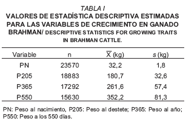
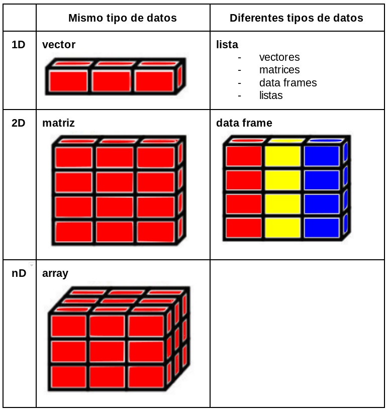

```{r, include=FALSE}
library(knitr)
opts_chunk$set(echo = TRUE, fig.align="center")
library(kableExtra)
```

# Datos: tipos y estructuras {#data_type}

## Tipos de datos 

La unidad básica de datos en R es un vector, los cuales pueden ser de diferentes clases. Los que más usaremos son las siguientes cuatro clases. 

```{r data_types, tidy=FALSE, eval=TRUE, echo = FALSE, results='asis'}
text_tab0 <- data.frame(
  Clase = c(
    "numeric", 
    "logical", 
    "integer", 
    "character"),
  Ejemplo = c("c(12.3, 5, 999)",
              "c(TRUE, FALSE)",
              "c(2L, 34L, 0L)",
              "c('a', 'good', 'TRUE', '23.4')"))

kable(text_tab0, 
             caption = 'Data types',
             booktabs = TRUE) %>% kable_styling(full_width = F)

```

### Vectores

```{r}
# concatenación de elementos atómicos
v <- c(8, 7, 9, 10, 10, 111)
class(v)

(b <- c("A", "b"))
class(b)
is.character(b)
is.numeric(b)

(m <- c(TRUE, FALSE, T, F)) ; class(m)

# Propiedades de v
# ?length
length(v)  
summary(v) 
#v <- edit(v)
sort(v)
```

* Operaciones con vectores

```{r, eval=FALSE}
v - 1

# Medidas de posición
mean(v) 
median(v)

# Medidas de dispersión
var(v)
sd(v)
sqrt(var(v))

IQR(v)
range(v)

quantile(v, 0.1)
ecdf(v)(7)

max(v)
min(v)
sum(v)
```

> Cree tres nuevos vectores que sean: i) la potencia cuadrada de 3.5 de v; ii) la raiz cubica de v; iii) el logaritmo natural de la diferencia de i) y ii)

* Secuencia

```{r, eval=FALSE}
1:7  
seq(from = 0, to = 20, #by=2) # 
    length=4) 

rep(1:3, times=3) #  , each=3   
```

* Números aleatorios - distribuciones

```{block, type='rmdnote'}
**Tendencias genéticas y fenotípicas de características de crecimiento en el ganado brahman de registro de México**
[@parra2007tendencias]
```

{width=300px}

```{r EjemploVacas, eval=FALSE}
set.seed(123)
PesoNac <- rnorm(23570, mean=32.2, sd=1.8) 
range(PesoNac)
hist(PesoNac)
hist(PesoNac, prob=TRUE)
```

* Propiedades de vectores 

Si colocaramos dos o mas clases diferentes dentro de un mismo vector, R va forzar a que todos los elementos pasen a pertenecer a una misma clase. El número 1.7 cambiaria a  "1.7" se fuera creado junto con "a".

```{r, eval=FALSE}
y <- c(1.7, "a")  ## character
y <- c(TRUE, 2)   ## numeric
y <- c(TRUE, "a") ## character
```

Forzando las clases explicitamente

`as.character()`, `as.numeric()`, `as.integer()` y `as.logical()`

* Factores

Factores pueden ser considerados como vectores de enteros que poseen rótulos (labels).

```{r, eval=FALSE}
resist <- c("R", "S", "S", "S", "R")
class(resist)
res_f <- as.factor(resist)
res_f
as.numeric(res_f)

table(resist)
pie(table(resist))
barplot(table(resist))
```

De factor para numérico

```{r, eval=FALSE}
niv_res <- factor(c("1", "5", "7", "9"))
sum(niv_res)
niv_res1 = as.numeric(niv_res)
mean(niv_res1)
niv_res2 = as.numeric(as.character(niv_res))
mean(niv_res2)
```

* Indexación

```{r}
y <- 1:10
y[ ]
y[2]
y[1:3]
```

> Seleccione los elementos 1° y 3°

* Condición

```{r}
# ifelse(condición, valor_si_TRUE, valor_si_FALSE)
ifelse(y<2, "Low", "High")
```

```{block, type='rmdnote'}
Se evaluaron 10 clones de porta-injertos de cítricos según su resistencia a Gomosis del Tronco (Phytophthora parasitica). Los diámetros de la lesión (cm) en el punto de inoculación fueron: 3, 6, 1, 10, 3, 15, 5, 8, 19, 11.
```

> Crear un vector "resist" con las categorías S o R, "S" aquellos clones con lesiones por encima de la mediana, y "R" clones con lesiones por debajo de la mediana.

</br>

### Valores especiales

Existen valores reservados para representar datos faltantes, infinitos, e indefiniciones matemáticas.

- NA (Not Available) significa dato faltante/indisponible. El NA tiene una clase, o sea, pueden ser NA numeric, NA character, etc.

- NaN (Not a Number) representa indefiniciones matemáticas, como 0/0 y log(-1). Un NaN es un NA, pero no reciprocamente.

- Inf (Infinito) es un número muy grande, por ejemplo, 1/0 o 10^310. Acepta signo negativo -Inf.

- NULL representa  ausencia de información. 


```{r}
# NaN es el resultado de una operación matemática inválida. Significa Not A Number
0/0
is.nan(0/0)
is.na(0/0)

# NULL es el vacio de R. Es como si el objeto no existiese
a = NULL
a

# Inf significa infinito. Es el resultado de operaciones matemáticas cuyo limite es infinito.
1/0
1/Inf
```

```{r}
# NA es una constante lógica de R. Significa Not Available. NA puede ser 
# convertido para casi todos los tipos de vectores de R. Se usa principalmente para indicar valores faltantes.
y <- c(2, 4, NA, 6)
is.na(y)
mean(y)
```

> Calcule el promedio de y (use la ayuda de R en caso necesario)

## Estructura de datos

{width=400px}

### Data frames

Conjunto de observaciones (filas) y variables (columnas). A diferencia que en las matrices, las columnas pueden tener diferentes tipos (clases) de variables como por ejemplo numéricas, categóricas, lógicas, fechas.

En numerosos paquetes de R, hay data frames disponibles para ejemplos de aplicación de funciones. Un ejemplo muy usado, que está en el paquete `base` es el dataset "iris".

```{r, eval=FALSE}
?iris
View(iris) # ya activo desde inicio de sesión por default
```

> Explore el dataset iris con las siguientes funciones con iris y anote sus resultados
- head() 
- tail() 
- dim() 
- names() 
- str() 

### Filtrado de datasets

**data[fila, columna]**

```{r}
iris[1,]
iris[,1]
iris[1,1]

iris$Sepal.Length
levels(iris$Species)
summary(iris$Sepal.Length)
```

> Selecione la segunda i) fila; ii) columna. iii) Seleccione la observación ubicada en la 2° fila y 3° columna iv) Seleccione las observaciones de las lineas 50 a 60 de las columnas 3 y 4. 

* Función `subset`

Filtremos a la variedad Species reteniendo solo a "setosa" 

```{r}
iris_setosa <- subset(iris, Species=="setosa")
```

Filtremos a la variedad Species reteniendo solo a "setosa" + "virginica"

```{r}
iris_set.virginica <- subset(iris, Species %in% c("setosa", "virginica"))
```

Agreguemos una condición: a lo anterior quedemonos con aquellas filas en que Sepal.Length > 5

```{r}
iris2 <- subset(iris, Species %in% c("setosa", "virginica") & Sepal.Length > 5)
```

> Que pasa si cambiamos el operador `&` por `|`?

### Listas

Objetos que aceptan elementos de clases diferentes.

```{r}
x <- list(a = 1:5, b = c("a", "b"), c = TRUE)
x
```

```{r}
x$a       # 
x[1]       # 
#sum(x[1])
x[[1]]     # 
sum(x[[1]])
x["c"]     # 
```
