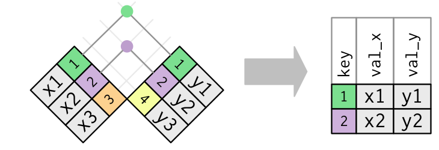

```{r include=FALSE}
knitr::opts_chunk$set(echo = TRUE, 
                      warning = FALSE, 
                      message = FALSE, 
                      eval=FALSE, 
                      fig.path = "figures/", 
                      fig.width = 12, 
                      fig.height = 8)
options(width = 90)
library(tidyverse)
#https://www.listendata.com/2016/08/dplyr-tutorial.html
```

# Manipular {#manip}

Muchas veces los datos que importamos ya están listos para ser explorados y analizados. Otras veces precisan ser manipulados previamente para ello. En estos casos se parte de un dataset “crudo” y se transforma hacia un dataset "analítico". 

Recordando que un dataset debe ser completo con dimensiones n_fila x p_columna, donde:

1- Cada fila debe contener toda la info de la unidad experimental que se está evaluando

2- Cada columna representa una variable (descriptiva o respuesta)

3- Cada celda debe tener su observación (en caso de faltar el dato será un NA) 

 

`tidyr` y `dplyr` integran parte de la colección de paquetes de `tidyverse` y facilitan la manipulación de los data frames [@wickham2016r] 

```{r}
library(tidyverse)
```

Ambos paquetes utilizan el operador `%>%` (pipe, tubo en español) lo que proporcionan una mejor interpretación lógica: utiliza el resultado de su lado izquierdo como primer argumento de la función del lado derecho (asemejándose a una receta de torta...)

```{r}
x <- c(1, 2, 3, 4)
x %>% sum %>% sqrt
```

Su equivalente de código básico es:

```{r}
sqrt(sum(x))
```

Importemos "soja" para ver alguno ejemplos.

```{r}
load("./data/datos_crudos.RData")
# browseURL("https://osf.io/jpfet/")
```

## dplyr::

<center>
{width=200px}
</center>

Los cinco verbos (funciones) principales de `dplyr` son:

`select` `filter` `mutate` `arrange` `summarise` 

<br>

### select


Vamos a seleccionar las variables: study, year, cultivar, fungic, rep, sev y yield. 

```{r}
soja %>% 
  select(study, year, cultivar, fungic, rep, sev, yield)
```

Es posible usar intervalos de varibles con `:`.

Una selección “negativa” de las variables no deseadas daría un mismo resultado:

```{r}
soja %>% 
  select(-Yld_level, -YR_class, -gr_hab, -sev_check)
```

### filter


Semejante a `subset`. Condiciones separadas por comas equivalen a `&` de `subset`.
Filtremos la variable fungicida (fungic) por el testigo (ZZ_CHECK)

```{r}
soja %>% 
  select(study:yield) %>% 
  filter(fungic == 'ZZ_CHECK')
```

Ahora, agreguemos el fungicida carbendazim a dosis de 1 litro (CZM[1]) al dataset

```{r}
soja %>% 
  select(study:yield) %>% 
  filter(fungic %in% c("ZZ_CHECK","CZM[1]"))
```

### mutate

* Alistar los datos crudos recien importados 

Haremos que las variables tipo caracter sean convertidas a factores:

```{r}
soja <- soja %>% 
  mutate_at(vars(c("cultivar", "fungic","Yld_level", "YR_class", "gr_hab")), funs(as.factor))

summary(soja)
str(soja)
```

```{r}
canola <- canola %>% 
  mutate_at(vars(c("trt","bk")), funs(as.factor)) %>% 
  mutate_at(vars(`15`: "sev_cank"), funs(round(., 2)))
```

* Creación de nuevas variables (a partir de las existentes)


Muchas variables biológicas no cumplen con los supuestos de las pruebas estadísticas  paramétricas: no se distribuyen [normalmente](https://en.wikipedia.org/wiki/68%E2%80%9395%E2%80%9399.7_rule#/media/File:Empirical_rule_histogram.svg), las desviaciones estándar no son homogéneas, o ambas. 

Hay extensa bibliografia al respecto, recomendando cual transformación es la más adecuada para cada tipo de variable y asi poder ser analizada por un ANOVA tradicional (paramétrico). 

Como fitopatólogos, la no normalidad es lo predominante. 

El caso mas común es la severidad de enfermedades que comparamos a través de diferentes tratamientos (cultivar, fungicida, practica de manejo, etc.)

Dos transformaciones son mayormente sugeridas para la severidad: 

* Transformacion Arcsine:consiste en tomar el arcoseno de la raiz cuadrada de un numero. 

* Transformación logit: 

```{r}
soja1 <- soja %>% 
  select(study:yield) %>% 
  filter(fungic %in% c("ZZ_CHECK","CZM[1]")) %>% 
  mutate(sev_arc = asin(sqrt(sev/100)),
         sev_logit =  car::logit(sev, percents=TRUE),# log(sev/100/(1-sev/100)), #  
         yield_tn = yield/1000) 

# browseURL("http://strata.uga.edu/8370/rtips/proportions.html")
```


```{r}
soja <- readr::read_csv("data/soja_mancha.csv")
soja <- soja %>% mutate_if(is.character, as.factor)
```


### arrange

Ordena crecientemente de acuerdo a la columna que le indiquemos. Utilizar `desc` para orden decrescente.

```{r}
soja1 %>% arrange(year, cultivar)
soja1 %>% arrange(year, desc(cultivar))
```

### summarise


Generalmente acompañada de la función `group_by` la cual permite aplicar un cálculo a las observaciones agrupando por niveles de algún factor (equivale a una tabla dinámica de excel)  


Veamos cuanto fue el rendimiento promedio y el desvio standard para cada fungicida a través de todos los ensayos: 

```{r}
soja %>% 
  group_by(fungic) %>% 
  summarise(yield_mean =  mean(yield),
            yield_sd = sd(yield)) 
```

> Calculen el rendimiento mínimo y máximo por fungicida

Algunas funciones interesantes para la descripción del dataset: `n()`, `n_distinct()`.

- Cuantos ensayos fueron realizados por año:
 
```{r}
soja %>% group_by(year) %>% 
  summarize(n = n_distinct(study)) 
```

- Cuantas parcelas tenia cada ensayo:

```{r}
soja %>% 
  group_by(study, year, cultivar) %>% 
  summarize(plots = n()) 
```

> Adicione una columna de potencial de rendimento del ensayo (rend_pot), considerando el máximo rendimiento observado en ese ensayo.

> Usando la función `ifelse` cree una nueva variable categórica "presión de enfermedad" considerando a "sev_check": Low o High

```{r}
by_check =  soja %>%  
  filter(fungic=="ZZ_CHECK") %>%
  group_by(study) %>% 
  summarize(sev_check = round(mean(sev, na.rm = TRUE),1)) %>% 
  mutate(Dis_level = ifelse(sev_check < 30, "Low", "High")) 
```

## tidyr::


Caso canola:

```{r}
canola <- readxl::read_excel("data/can_phoma.xlsx")
```

Esto seria uma forma "wide" de representación del dataset (crudo).

Para analizar el efecto del tratemiento fungicida necesitamos calcular el área bajo la curva (AUC) del progreso de la enfermedad. Para esto vamos a transponer can_phoma al formato "long". La función `gather` (del inglés "reunir", paquete `tidyr`) apila las columnas que indiquemos.


```{r}
canola %>%  
  gather(`15`, `58`, `95`, `146`, `165`, `180`, `248`, 
         key = "tt", value = "inc") -> can_long

# save(soja, canola, can_long, file = "data/soja_canola.RData")
```

```{r}
can_long
# Precisamos que tt sea clase "numérica" para ciertos cálculos
can_long <- can_long %>% 
  mutate_at(c("trt","bk"), funs(as.factor)) %>% 
  mutate_at(c("tt", "inc"), funs(as.numeric))
```

Calcularemos un valor de AUC por parcela con auxilio de las funciones `group_by` y `summarize` 

```{r}
# if(require(MESS)) {install.packages("MESS")}
can_long %>%
  group_by(trt, bk) %>%
  summarize(AUC = MESS::auc(inc, tt))
```

Ahora si, can_phoma está listo para entrar al próximo paso: modelado.

### join



junta dos data.frames a través de puntos en común.


Por ejemplo, si queremos unir las variables "sev_check" y "Dis_level" al dataset soja:

```{r}
soja %>% inner_join(by_check, by="study")
```

## forcats::

Es un excelente aliado para manipular factores, principalmente cuando de graficar se trata. [link](https://forcats.tidyverse.org/) 

```{r, eval=FALSE}
library(forcats)

dat %>%
  mutate(trt1= fct_recode(trt,
                          `Czm` = "CZM[1]", # `nombre_nuevo` = "nombre_original" 
                          `Czm+CM+Tebu` = "CZM_CM_TEBU[1]",
                          `Epo+Flux+Pyra (0.8L)` = "EPO_FLUX_PYRA[0.8]",
                          `Check` = "ZZ_CHECK"),
         trt1= fct_relevel(trt, # Asignar a trt1 nuevo orden de los factores 
                           "Check", "Czm", "Czm+CM+Tebu", "Epo+Flux+Pyra (0.8L)")) %>%
  ggplot(aes(x, y)) + geom_boxplot()+
```


