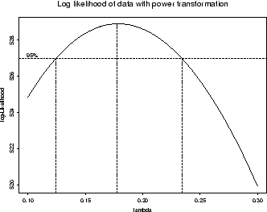

```{r include=FALSE}
knitr::opts_chunk$set(echo = TRUE, 
                      warning = FALSE, 
                      message = FALSE, 
                      eval=FALSE, 
                      fig.width = 12, 
                      fig.height = 8)
options(width = 90)
```

```{r}
library(tidyverse)
```

# Modelos 

## Modelos lineales

Un solo factor - experimento DCA: dataset `PlantGrowth`

```{r}
?PlantGrowth
plant_g <- PlantGrowth # simplificamos el nombre del dataset
```

- Exploración  

```{r}
str(plant_g) # tipo de variables
```

```{r}
summary(plant_g) # exploración numérica
```

```{r}
# exploracion numerica por tratamiento
plant_g %>%
  group_by(group) %>%
  summarise(
    count = n(),
    mean = mean(weight, na.rm = TRUE),
    sd = sd(weight, na.rm = TRUE)
  )
```


```{r}
# Exploración gŕafica
plant_g %>% 
  ggplot(aes(x=group, y=weight)) + 
  geom_boxplot(width=0.2)+
  geom_jitter(alpha=0.2, width=0.2)+
  theme_light()
```

Ajuste del modelo lineal

$$y_{ij} = \mu + \alpha_i + e_{ij}; \:\:i = 1,..., k; \:j = 1,..., n$$
$$N \~ (\sigma^2, 0)$$

```{r}
mod1 <- lm(weight ~ group, data = plant_g)  
```

- Diagnósticos

Las varianzas (entre niveles del factor) son homogéneas? 

```{r}
# homocedasticidad
plot(mod1, which = 1)
car::leveneTest(mod1)
```

Los residuos se distribuyen normales?

```{r}
plot(mod1, which = 2)
shapiro.test(mod1$residuals)

# my_data$fit = mod1$fitted.values
# my_data$res = my_data$fit - my_data$weight
# mean(my_data$res)
# names(mod1)hist(m_fix$residuals)
```

```{r}
anova(mod1)# caso balanceado
# car::Anova(mod1)# caso desbalanceado
```

Test de comparación múltiple (de medias estimadas de los tratamientos)

```{r}
library(emmeans)
em <- emmeans(mod1, ~ group, type="response")
em

res = CLD(em, Letters = letters, reverse = FALSE, alpha = .05)
res
```

Dos factores: 

```{r}
?ToothGrowth
tg <- ToothGrowth
```

- Exploración  

```{r}
str(tg) # tipo de variables
```

```{r}
tg <- tg %>% mutate_at(vars(dose), funs(as.factor)) 
```


```{r}
summary(tg) # exploración numérica
```

```{r}
# exploracion numerica por tratamiento
tg %>%
  group_by(supp, dose) %>%
  summarise(
    count = n(),
    mean = mean(len, na.rm = TRUE),
    sd = sd(len, na.rm = TRUE)
  )
```

```{r}
# Exploración gŕafica
tg %>% 
  ggplot(aes(x = factor(dose), y = len, colour = supp)) + 
  geom_boxplot() + 
  theme_bw()
```


```{r}
mod2 <- lm(len ~ supp * dose, data = tg) # equivale a supp + dose + supp:dose
anova(mod2)
```


- comparaciones múltiples (un factor dentro del otro)

```{r}
# emmip(mod2, supp~ dose)
emm_tg <- emmeans(mod2, pairwise ~ supp | dose)
CLD(emm_tg, Letters = letters, reverse = FALSE, alpha = .05)

emm_tg2 <- emmeans(mod2, pairwise ~ dose|supp)
CLD(emm_tg2, Letters = letters, reverse = FALSE, alpha = .05)
```


**Transformación potencia óptima de boxcox**

Esta transformación solo tiene un parámetro: lambda, graficado en el eje x. Si el valor de lambda es igual a cero, se lleva a cabo la transforma con el logaritmo natural, y si dicho valor es distinto a cero la transformación es potencial. 

{width=300px} 

{width=350px}{width=350px}

Si el parámetro lambda es igual a uno, no hace falta transformar la variable respuesta. Si el intervalo (lineas punteadas verticales) no contiene a 0 ni a 1, hay que transformar la variable elevando a la potencia del valor de lamba incluido en el intervalo 

La utilización de la transformación Box-Cox requiere que todos los valores de la serie de entrada sean positivos y distintos a cero.
Por ello es adicionada una constante a la variable original (0.5, por ej.)

En el caso de la derecha, el modelo resultaria: 

```{r}
lm((y+0.5)^0.2 ~ trt + bk, ...)
```

## GLM

### Variable **conteo**

```{r}
?InsectSprays
ins_sp <- InsectSprays

ins_sp %>% 
  ggplot(aes(x=spray, y=count)) + 
  geom_boxplot(width=0.2)+
  geom_jitter(alpha=0.2, width=0.2)+
  theme_light()

ins_sp %>% 
  ggplot(aes(x=count)) + 
  geom_dotplot()+
  theme_light()
```

Modelar como modelo lineal?

```{r}
plot(lm(count ~ spray, data = InsectSprays), which=2)
# MASS::boxcox(lm(count+.1 ~ spray, data = InsectSprays))
# MASS::boxcox(lm(sqrt(count+.1) ~ spray, data = InsectSprays))

```

Ajuste de modelo lineal generalizado

```{r}
mod_spray = glm(count ~ spray, family=poisson, data=ins_sp) # full model
car::Anova(mod_spray)
```

Diagnóstico del modelo 

```{r}
ggfortify::autoplot(mod_spray, which = 1:6, label.size = 3)
```

Estimación de media de los tratamientos y comparaciones entre ellas

```{r}
library(emmeans)
em_poi <- emmeans(mod_spray, ~ spray, type="response")
em_poi

res_poi = CLD(em_poi, Letters = letters, reverse = FALSE, alpha = .05)
res_poi

```

* Lexturas recomendadas 

- [Analysis and Interpretation of Interactions in Agricultural Research](https://dl.sciencesocieties.org/publications/aj/pdfs/107/2/748)

- [Analysis of Combined Experiments Revisited](https://dl.sciencesocieties.org/publications/aj/pdfs/107/2/763)

- [Model Syntax in R](http://conjugateprior.org/2013/01/formulae-in-r-anova/)

- [ANOVA: A Short Intro Using R](https://stat.ethz.ch/~meier/teaching/anova/)

- [glmmFAQ](https://bbolker.github.io/mixedmodels-misc/glmmFAQ.html)

- [A brief introduction to mixed effects modelling and multi-model inference in ecology](https://peerj.com/articles/4794/)

- [Data Analysis Examples](https://stats.idre.ucla.edu/other/dae/)

- [Data Analysis and Visualization in R for Ecologists](https://datacarpentry.org/R-ecology-lesson/index.html)
