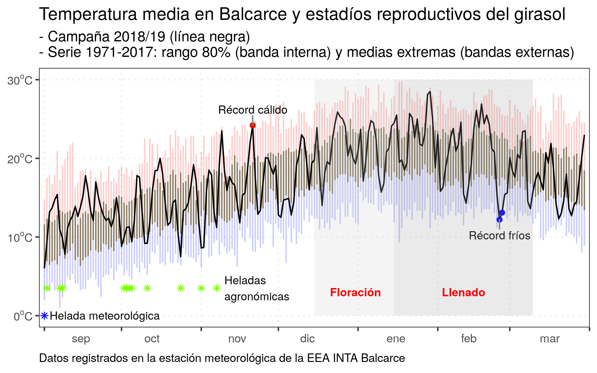
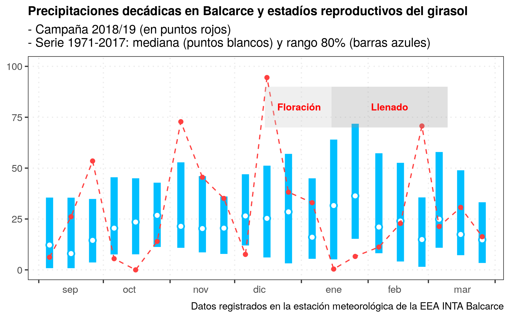

```{r include=FALSE}
knitr::opts_chunk$set(echo = TRUE, 
                      warning = FALSE, 
                      message = FALSE, 
                      eval=TRUE, 
                      fig.width = 8, 
                      fig.height = 5)
options(width = 90)
library(tidyverse)
```

# Manipular fechas {#fechas}

Saber manipular variables de tipo fechas resulta de gran practicidad debido a que, como investigadores del área de ciencias agrarias / biológicas, lidiamos constantemente con el tiempo en nuestros experimentos. Aprovechar las nuevas funciones de los paquetes de R que permiten realizar cálculos o gráficas variables de tipo fechas nos optimizará nuestro trabajo cotidiano ya que nos evitará tener que realizar cálculos intermedios para convertir las fechas a días, ya que R hará ese trabajo invisiblemente (y sin errores).    

A continuación haremos una demostración simple de cómo operar con fechas involucrando a variables meteorológicas y de fenología de cultivos.

## Análisis de temperaturas

Importamos un dataset de datos meteorológicos de Balcarce desde 1971 a 2019:

```{r}
bce <- readxl::read_excel("./data/bce_clima.xlsx") %>%
  mutate(year = lubridate::year(date),
         month = lubridate::month(date),
         julian = lubridate::yday(date))

head(bce)
tail(bce)
```

Construimos la banda central de medias mínimas y máximas de cada día:

```{r}
bce_serie <- bce %>%
  filter(year<2018) %>%
  group_by(julian) %>%
  summarise(
    month = first(month),
    avg = mean(tmean, .2, na.rm = T),
    # Rango 80% de los años (rango interno)
    lower_80=quantile(tmean, .2, na.rm = T),
    upper_80=quantile(tmean, .8, na.rm = T),
    # Min y max de tmean (rango externo)
    lower_tmean=min(tmean, na.rm = T),
    upper_tmean=max(tmean, na.rm = T)) %>%
  ungroup()
bce_serie
```

Filtramos el dataset para la reciente campaña de grano grueso (primavera- verano - otoño):

```{r}
bce_18_19 <-
  bce %>%
  filter(date > '2018-08-31', date < '2019-03-30') %>%
  left_join(bce_serie, by = c("julian", "month")) %>%
  mutate(date = as.Date(date)) %>%
  droplevels()
bce_18_19
```

Graficamos las bandas de 80% de la temperatura media diaria de la serie histórica y las temperaturas medias observadas en la reciente campaña: 

```{r}
p1 <-
  ggplot(bce_18_19, aes(x=date)) +
  geom_linerange(aes(ymin=avg, ymax=upper_tmean), colour = "red", alpha=.2)+
  geom_linerange(aes(ymin=lower_tmean, ymax=avg), colour = "blue", alpha=.2) +
  geom_linerange(aes(ymin=lower_80, ymax=upper_80), colour = "wheat4")+
  geom_line(aes(y = tmean)) +
  scale_y_continuous(labels = numform::f_celcius, limits = c(0, 30), expand = c(0.05, 0))+
  scale_x_date(date_breaks = "1 month", date_labels="%b", expand=expand_scale(0.01,0))+
  theme_bw()+
  theme(axis.text.x = element_text(hjust = -1.5),
        panel.grid.minor = element_blank(),
        panel.grid.major = element_line(linetype="dotted"))
p1
```


Exploramos si hubo días con temperatura media mayor o menor a la serie histórica: 

```{r}
rec_frio <- bce_18_19[which(bce_18_19$tmean<bce_18_19$lower_tmean),]
rec_cal <- bce_18_19[which(bce_18_19$tmean>bce_18_19$upper_tmean),]
```

En caso de haberlos los agregamos al gráfico base, así como las heladas meteorológicas (Tmín<=0°C) o agrometeorológicas (Tmín<=3°C):

```{r}
library(ggrepel)
options(repr.plot.width = 2, repr.plot.height = 2)

p2 <- p1 +
  # Agregar medias record frío
  geom_point(data = rec_frio, aes(date, y = tmean), colour = "blue") +
  geom_text_repel(data=rec_frio[1,], aes(y=tmean, label="Récord fríos"), size=3,
                  min.segment.length = unit(0, 'lines'), nudge_y = -2, segment.color="grey50")+
  # Agregar medias record cálido
  geom_point(data =rec_cal, aes(date, y = tmean), colour = "red")+
  geom_text_repel(data = rec_cal, aes(y=tmean, label="Récord cálido"), size=3,
                  min.segment.length = unit(0, 'lines'), nudge_y=2, segment.color="grey50")+
  # Agregar heladas meteorologicas y agrometeorológicas
  geom_point(data = bce_18_19[which(bce_18_19$tmin<=0),],
             aes(date, y = 0), shape=8, colour = "blue") +
  geom_point(data = bce_18_19[which(bce_18_19$tmin>0 & bce_18_19$tmin<=3),],
             aes(date, y = 3.5), shape=8, colour = "chartreuse")+
  annotate("text", x = c(as.Date("2018-09-3"), as.Date("2018-11-10")), y = c(0,3.5),
           label = c("Helada meteorológica","Heladas\nagronómicas"), size=3, hjust = 0)
p2
```

Finalmente agregamos los estadíos reproductivos del cultivo de girasol.

Para ello haremos algunos cálculos con los intervalos de tiempo de los estadíos reproductivos floración (r5) y llenado de granos (r6):

```{r}
r5 = c(as.Date("2018-12-15"),  as.Date("2019-01-15")); diff(r5)
r6 = c(as.Date("2019-01-15"),  as.Date("2019-03-10")); diff(r6)

midpoint <- function(interval) {
  min(interval) + (max(interval) - min(interval))/2
} ; midpoint(r5) #ej
```


```{r}
p_final <- p2 +
  # barras de floracion y llenado
  annotate("rect", xmin= c(min(r5), min(r6)), xmax=c(max(r5),max(r6)), ymin=0, ymax=30, alpha=0.2, fill=c("grey80","grey60"))+
  annotate("text", x = c(midpoint(r5), midpoint(r6)), y=3,
           label = c('bold("Floración")','bold("Llenado")'),
           colour = "red", parse = TRUE, size=3) +
  labs(x=NULL, y=NULL,
       title = "Temperatura media en Balcarce y estadíos reproductivos del girasol",
       subtitle = "- Campaña 2018/19 (línea negra)\n- Serie 1971-2017: rango 80% (banda interna) y medias extremas (bandas externas)",
       caption = "Datos registrados en la estación meteorológica de la EEA INTA Balcarce")+
  theme(plot.caption = element_text(hjust = 0))
p_final
```




## Análisis de precipitaciones

```{r}
suppressWarnings(suppressMessages(library("tidyverse", quietly = T)))
library(lubridate)
```

```{r}
bce <- readxl::read_excel("./data/bce_clima.xlsx") %>%
  mutate(year = lubridate::year(date),
         month = lubridate::month(date),
         julian = lubridate::yday(date))
```

Calculamos las lluvias acumuladas por década. 

- Primero para la serie histórica: 

```{r}
bce_serie <-
  bce %>%
  filter(year!=2018) %>%
  group_by(date=if_else(day(date) >= 30,
                        floor_date(date, "20 days"),
                        floor_date(date, "10 days"))) %>%
  summarize(rain_acum = sum(rain),
            days = n()) %>%
  mutate(year = year(date),
         month = month(date)) %>%
  # julian = yday(date)) %>%
  ungroup %>%
  group_by(year) %>%
  mutate(decada = row_number()) %>%
  ungroup %>%
  group_by(decada) %>%
  summarise(month = first(month),
            med = quantile(rain_acum, .5, na.rm = T),
            lower_80=quantile(rain_acum, .2, na.rm = T), # Rango 80% de los años
            upper_80=quantile(rain_acum, .8, na.rm = T))
```

- Luego para la reciente campaña de grano grueso:

```{r}
bce_18_19 <-
  bce %>%
  group_by(date = if_else(day(date) >= 30,
                          floor_date(date, "20 days"),
                          floor_date(date, "10 days"))) %>%
  summarize(rain_acum_season = sum(rain)) %>% #, days=n()) %>%
  mutate(year = year(date),
         month = month(date)) %>%
  group_by(year) %>%
  mutate(decada = row_number()) %>%
  filter(date > '2018-08-31', date < '2019-03-30')
```

- Fusionamos ambos datasets en base al de la actual campaña (que es el que tiene las fechas):

```{r}
bce_18_19 <-
  bce_18_19 %>%
  left_join(bce_serie, by = c("decada")) %>%
  mutate(date = as.Date(date))
# print(bce_18_19, n=Inf)
```


Ya estamos en condiciones de graficar ambos datasets.

- Configuramos el aspecto del gráfico:

```{r}
theme_set(theme_bw() +
            theme(axis.text.x = element_text(hjust=-1.5),
                  panel.grid.minor = element_blank(),
                  panel.grid.major = element_line(linetype="dotted"),
                  plot.title = element_text(size = 11, face = "bold"),
                  plot.caption = element_text(hjust=1)))

```


```{r}
# corregimos la posición de las barras desplazandolas hacia la derecha
p_5=position_nudge(x = 5)

(p1 <-
    bce_18_19 %>%
    ggplot(aes(x=date)) +
    geom_pointrange(aes(y=med, ymin=lower_80, ymax=upper_80), fill='white', color='deepskyblue',
                    shape=21, fatten=.7, size=3, position=p_5)+
    geom_point(aes(y=rain_acum_season), col ="brown1",
               position=p_5) +
    geom_line(aes(y=rain_acum_season, group=1), col ="brown1", linetype="dashed", position=p_5)+
    scale_y_continuous(limits=c(0, 100), expand=c(0.05, 0))+
    scale_x_date(date_breaks="1 month", date_labels="%b", expand=expand_scale(0.05,0))
)
```
                  
- Incluímos la fenología del girasol:

```{r}
r5 = c(as.Date("2018-12-15"),  as.Date("2019-01-15")); diff(r5)
r6 = c(as.Date("2019-01-15"),  as.Date("2019-03-10")); diff(r6)
midpoint <- function(interval) { min(interval)+(max(interval)-min(interval))/2 }; midpoint(r5)
```

```{r}
(p_final <-
   p1 +
   annotate("rect", xmin= c(min(r5), min(r6)), xmax=c(max(r5),max(r6)), ymin=70, ymax=90,
            alpha=0.3, fill=c("grey80","grey60"))+
   annotate("text", x = c(midpoint(r5), midpoint(r6)), y=80,col="red", parse=TRUE, size=3,
            label=c('bold("Floración")','bold("Llenado")')) +
   labs(x=NULL, y=NULL,
        title="Precipitaciones decádicas en Balcarce y estadíos reproductivos del girasol",
        subtitle="- Campaña 2018/19 (en puntos rojos)\n- Serie 1971-2017: mediana (puntos blancos) y rango 80% (barras azules)",
        caption="Datos registrados en la estación meteorológica de la EEA INTA Balcarce")
)

# ggsave(file = "plots/bce_lluvias.png", w=80, h=50, units="mm", dpi=300, scale=2)
```



