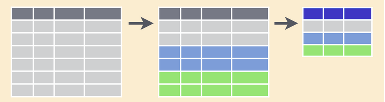

## dplyr::

Los principales cinco verbos (funciones)  de `dplyr` son:

`select` `filter` `mutate` `summarise` `arrange`

<br>

`select`


Vamos a seleccionar las variables: study, year y fungic del archivo soja: 


```r
soja_long %>% 
  select(trt, yield)

# Una selección “negativa” de las variables no deseadas daría un mismo resultado:
# soja_long %>% 
#   select(-bk)
```

### filter


Semejante a `subset`. Condiciones separadas por comas equivalen a `&` de `subset`.
Filtremos la variable fungicida (fungic) por el testigo (ZZ_CHECK):


```r
soja_long %>% 
  select(trt, yield) %>% 
  filter(trt == 'check')
```

Ahora, agreguemos el trt A al dataset filtrado:


```r
soja_long %>% 
  select(trt, yield) %>% 
  filter(trt %in% c("check","A"))
```

`mutate`

Permite operar sobre las columnas, modificando su naturaleza o haciendo operaciones sobre ellas (incluso generando nuevas columnas a partir de pre-existentes).

* Creación de nuevas variables (a partir de las existentes)


Supongamos que queremos analizar a yield en escala de quintal (100kg = 1qq)


```r
soja_long %>% 
  mutate(yield_qq = yield/100) %>% 
  select(-yield)
```


* Conversión de tipos de variables:

Ahora que hemos re-organizado los datos, queremos chequear los tipos de variables que tiene el dataset:


```r
str(soja_long)

soja_long %>% 
  mutate(yield_qq = yield/100) %>% 
  select(-yield) %>% 
  mutate_at(vars(trt, bk), as.factor) %>% 
  mutate_at(vars(yield_qq), as.numeric) -> soja_long1

str(soja_long1) 
```

### summarise


Generalmente acompañada de la función `group_by` la cual permite aplicar un cálculo a las observaciones agrupando por niveles de algún factor (equivale a una tabla dinámica de Excel)  



Veamos cuánto fue el rendimiento promedio y el desvío standard para cada fungicida a través de todos los ensayos: 


```r
soja_long %>% 
  group_by(trt) %>% 
  summarise(yield_mean =  mean(yield),
            yield_sd = sd(yield)) 
```

> Calculen el rendimiento mínimo y máximo de cada tratamiento

`arrange`

Ordenar columnas 


```r
soja_long %>% 
  arrange(trt, yield) %>% 
  print(n=Inf)
```

* Función `subset`

Filtremos a la variable Species reteniendo sólo a "setosa" 


```r
iris_setosa <- subset(iris, Species=="setosa")
```

Filtremos a la variable Species reteniendo sólo a "setosa" + "virginica"


```r
iris_set.virginica <- subset(iris, Species %in% c("setosa", "virginica"))
```

Anteponiendo el `!` a la condición estaremos aplicando la negativa de la condición.

> regenere `iris_set.virginica` usando `!` para mejorar el código

Agreguemos una condición: a lo anterior quedémonos con aquellas filas en que Sepal.Length > 5


```r
iris2 <- subset(iris, Species %in% c("setosa", "virginica") & Sepal.Length > 5)
iris2
dim(iris2)
```

> ¿Qué pasa si cambiamos el operador `&` por `|`?


```r
iris3 <- subset(iris, Species %in% c("setosa", "virginica") | Sepal.Length > 5)
iris3
dim(iris3)
```

> `iris4` no es un codigo suscinto... reformulelo en iris5 para que `identical(iris4, iris5) == TRUE`


```r
iris4 <- subset(iris, 
                !(Species %in% c("setosa", "virginica") |
                    Sepal.Length > 5)
                )
iris4
dim(iris4)
```


