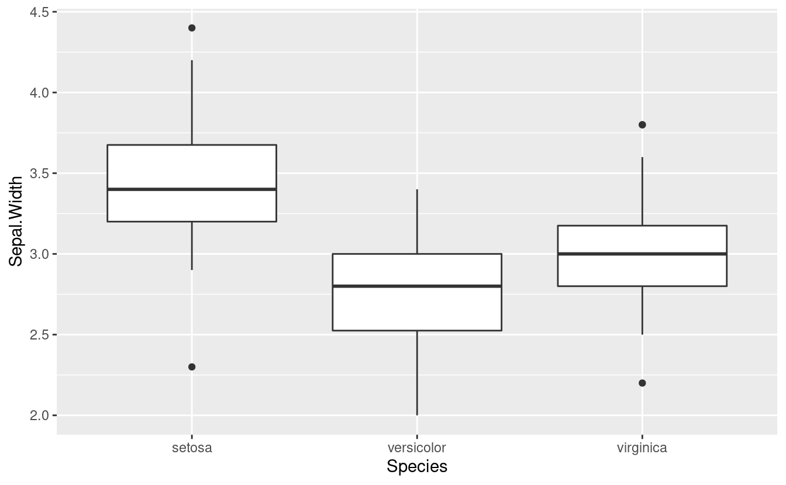
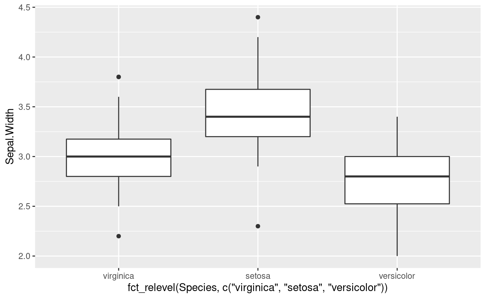
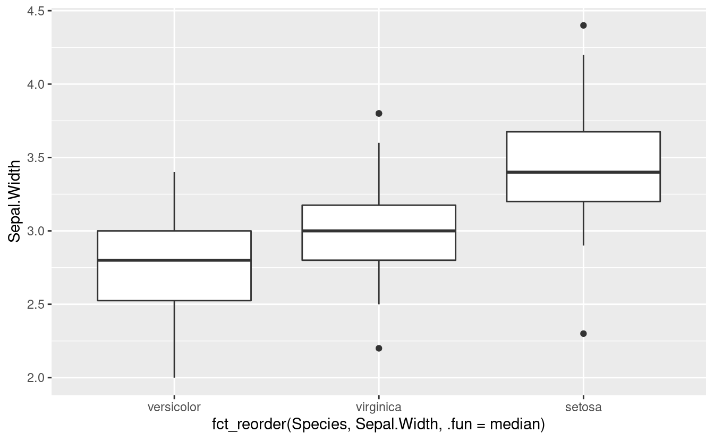
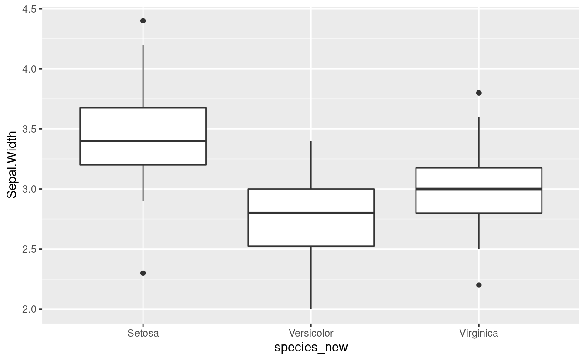
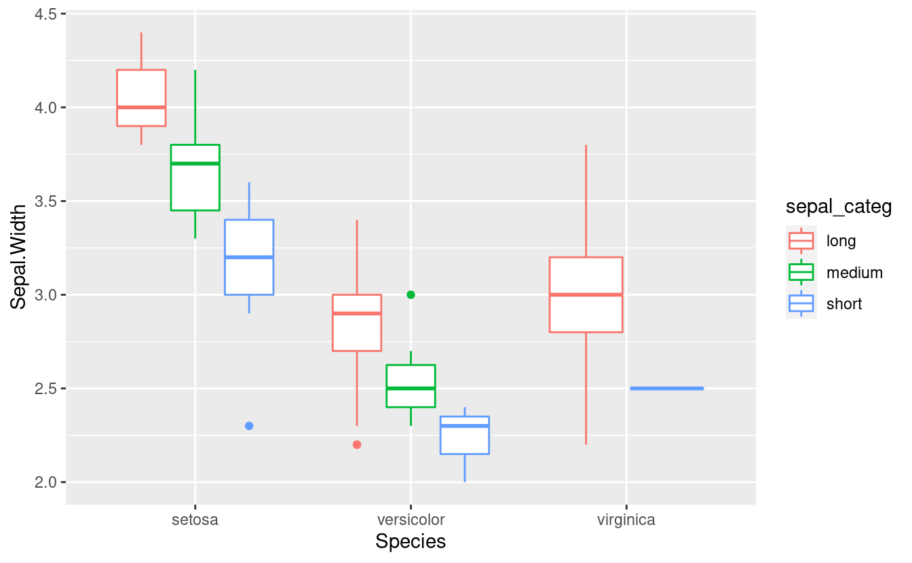
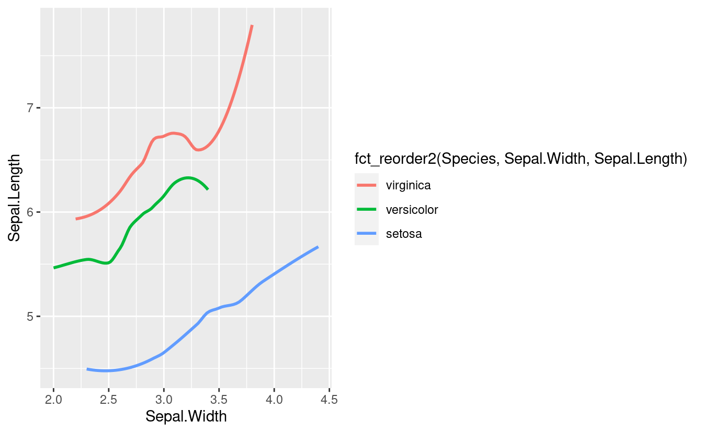
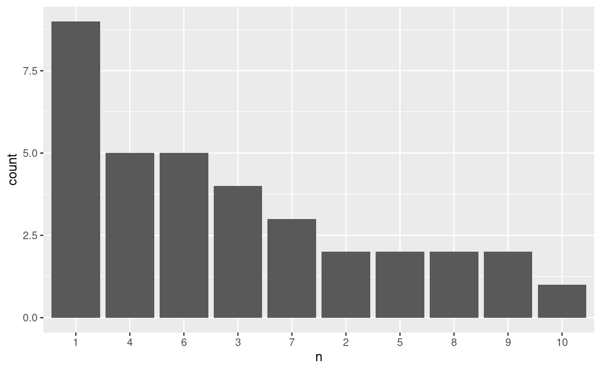

## forcats::

Es un excelente aliado para manipular factores, principalmente cuando de graficar se trata. [Sitio oficial](https://forcats.tidyverse.org/)- 
[machete](http://www.flutterbys.com.au/stats/downloads/slides/figure/factors.pdf) 


```r
library(tidyverse) 
```


```r
iris %>% 
  ggplot(aes(x = Species,y = Sepal.Width)) + 
  geom_boxplot()
```



`fct_relevel`

A veces queremos forzar los niveles según nuestro interés, por ejemplo, queremos posicionar al tratamiento control al inicio o al final.


```r
iris %>% 
  ggplot(aes(x = fct_relevel(Species, c("virginica", "setosa", "versicolor")), 
             y = Sepal.Width)) + 
  geom_boxplot()
```



`fct_reorder`

Cuando queremos ver el orden de los tratamientos rankeados según la variable.


```r
iris %>% 
  ggplot(aes(x = fct_reorder(Species, Sepal.Width, .fun=median), #.desc=TRUE 
             y = Sepal.Width)) + 
  geom_boxplot()#+
  # geom_jitter(position=position_jitter(0.1))+
  # coord_flip()
```



`case_when`

Asociado a `mutate`, cuando deseamos modificar el nombre de los niveles. 


```r
iris %>% 
  mutate(species_new = 
           # `nombre_nuevo` = "nombre_original" 
           case_when(Species=="setosa" ~ "Setosa",
                     Species=="versicolor" ~ "Versicolor",
                     Species=="virginica" ~ "Virginica")) %>%
           # TRUE ~ "Virginica"))
  ggplot(aes(x = species_new, y = Sepal.Width)) + 
  geom_boxplot()
```



O queremos generar un nuevo vector categórico a partir de una variable pre-existente.


```r
iris %>% 
  mutate(sepal_categ = 
           case_when(
             Sepal.Length > 5.5 ~ "long",
             Sepal.Length > 5 ~ "medium",
             TRUE ~ "short"
           )) %>% 
  ggplot(aes(x = Species, y = Sepal.Width, color = sepal_categ)) + 
  geom_boxplot()
```



`fct_reorder2`
Reordenar los nivels por su valor final cuando son graficados con otras dos variables.


```r
iris %>% 
  ggplot(aes(Sepal.Width, 
             Sepal.Length, 
             color = fct_reorder2(Species, Sepal.Width, Sepal.Length)))+
  geom_smooth(se=F)
```



`fct_infreq`

Reorder factors levels by first appearance or frequency


```r
iris %>%
  count(Sepal.Length) %>% 
  mutate(n=n %>% as.factor %>% fct_infreq) %>% 
  ggplot(aes(n)) +  
  geom_bar()
```


