# Visualizar {#explore}


La visualización de datos es una pieza fundamental del flujo de trabajo del científico, tanto para explorar sus observaciones, como para explicar/comunicar sus resultados e ideas. Es decir, dominar las herramientas de visualización resulta imprescindible para un investigador cuya materia prima son los datos.

La gran comunidad de usuarios de R disponibiliza sus creaciones e incluso trabaja en extensiones que amplían la potencialidad de sus paquetes. 

Se podría afirmar que no hay límites para la creación. Digamos, que no importa el "**¿cómo?**" si no el "**¿qué?**"

Algunas pruebas de ello son los siguientes links: 

- [The R Graph Gallery](https://www.r-graph-gallery.com/)
- [Top 50 plots](http://r-statistics.co/Top50-Ggplot2-Visualizations-MasterList-R-Code.html)
- [Extensiones de ggplot](http://www.ggplot2-exts.org/gallery/)

- [Fundamentals of Data Visualization](https://serialmentor.com/dataviz/)

El paquete [ggplot2](http://r4ds.had.co.nz/data-visualisation.html) tiene una flexibilidad tal que permite generar rápidamente gráficos exploratorios así como crear figuras complejas, detalladas, de alta calidad (con fines de publicaciones científicas). 


Tiene una gramática propia y la idea original es que un gráfico puede ser elaborado a partir de la combinación de capas, pudiendo tener éstas diferentes bases de datos y objetos gráficos (puntos, líneas, barras, etc).

<center>
{width=500px}
</center>

Agregaremos una a una las capas mencionadas en la figura. Éstas no tienen un orden estricto, salvo la primera que debe ser `ggplot()` que es la función que inicializa un gráfico. A ésta estarán asociados el dataframe principal (ya que un mismo gráfico acepta tomar información de distintos datasets), y las aesthetics que pueden ser seteadas globalmente para todo el gráfico o específicamente para cada nueva capa.   

* aesthetics

Se definen con aes().
Significado de aesthetic en ggplot: “Algo que se puede ver”.
Cada geom acepta un conjunto de aesthetics.
Ejemplos:
    + position (i.e., en el eje “x” e “y”)
      color (color “exterior”)
      fill (color “interior”)
      shape (de los puntos)
      linetype
    size
    
## Ambas variables contínuas


```r
library(tidyverse)
```


```r
iris %>% 
  ggplot(aes(x = Sepal.Length, y = Petal.Length))
```

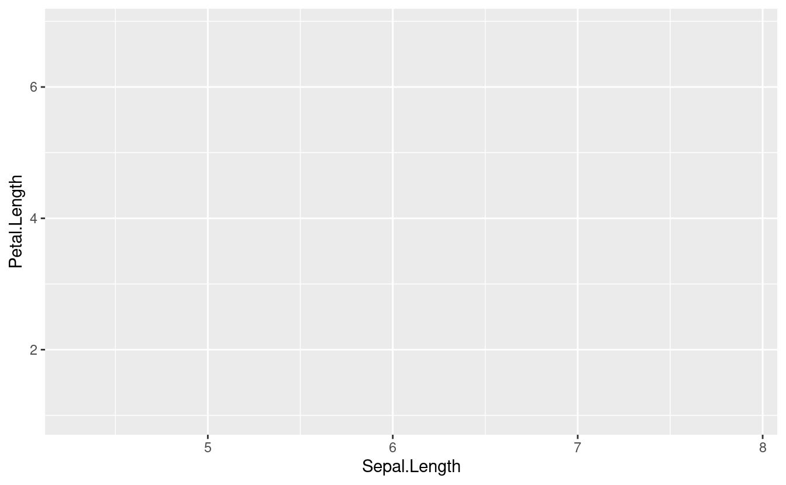

* geoms

Objetos geométricos. Son la representación visual de las observaciones. En general los que le dan el nombre al tipo de gráfico. La [lista de "geoms"](https://ggplot2.tidyverse.org/reference/#section-layer-geoms) aumenta día a día.  


```r
iris %>% 
  ggplot(aes(x=Sepal.Length, y=Petal.Length)) + 
  geom_point()
```

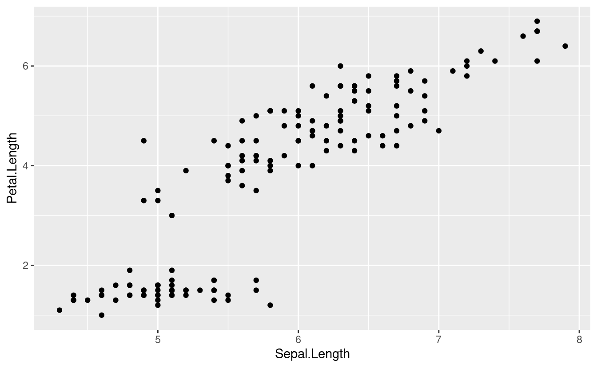


```r
iris %>% 
  ggplot(aes(x=Sepal.Length, y=Petal.Length)) + 
  geom_point(aes(color = Species))
```


```r
iris %>% 
  ggplot(aes(x=Sepal.Length, y=Petal.Length)) + 
  geom_point(aes(color = Species))+ 
  geom_smooth()
```

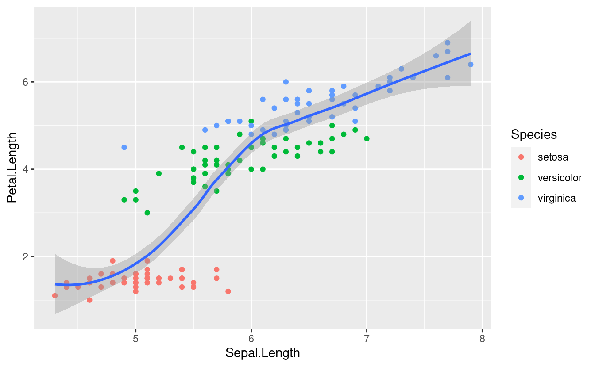


```r
iris %>% 
  ggplot(aes(x = Sepal.Length, y = Petal.Length, 
             color = Species)) + 
  geom_point()+
  geom_smooth()
```


* facets

Las facetas o “facets” permiten dividir el mismo gráfico en múltiples paneles asociados a los niveles de un factor.


```r
p <- iris %>% 
  ggplot(aes(x = Sepal.Length, y = Petal.Length)) + 
  geom_point()+
  geom_smooth(method = "lm")+
  facet_wrap(~Species)
p
```


* theme

Los temas (theme) son un conjunto de opciones predefinidas sobre la apariencia de los objetos en ggplot. El tema por defecto del ggplot dibuja el gráfico sobre un fondo gris. Podemos cambiarlo a blanco y negro añadiendo el comando theme_bw().


```r
p + theme_bw()
```


Si deseamos explorar las distribuciones de las variables podemos optar por un histograma o por diagramas de densidad.


```r
cowplot::plot_grid(
iris %>% 
  ggplot(aes(Petal.Length, fill=Species)) +
  geom_histogram()+
  guides(fill=FALSE)
,
iris %>% 
  ggplot(aes(Petal.Length, fill=Species)) +
   geom_density(alpha=0.7)
, 
align="h"
)
```

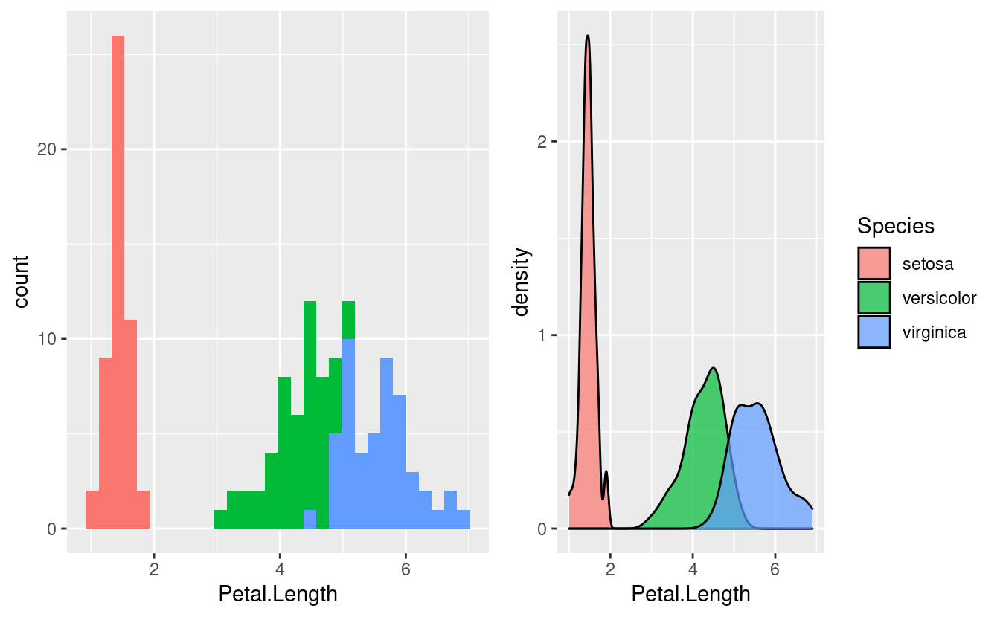

## Comparación de niveles de factores

Los gráficos de barra, ampliamente usados en publicaciones científicas, son cada vez más criticados por "ocultar" la naturaleza de las observaciones [@doi:10.1111/j.1476-5381.2011.01251.x; @10.1371/journal.pbio.1002128] (Sugerencia: leer el box 1 del último paper).


<div class="rmdnote">
<p>De <span class="citation">[@doi:10.1111/j.1476-5381.2011.01251.x]</span>: Fig 1. Many different datasets can lead to the same bar graph.</p>
<p>The full data may suggest different conclusions from the summary statistics. The means and SEs for the four example datasets shown in Panels B–E are all within 0.5 units of the means and SEs shown in the bar graph (Panel A). p-values were calculated in R (version 3.0.3) using an unpaired t-test, an unpaired t-test with Welch’s correction for unequal variances, or a Wilcoxon rank sum test. - In Panel B, the distribution in both groups appears symmetric. Although the data suggest a small difference between groups, there is substantial overlap between groups. - In Panel C, the apparent difference between groups is driven by an outlier. - Panel D suggests a possible bimodal distribution. Additional data are needed to confirm that the distribution is bimodal and to determine whether this effect is explained by a covariate. - In Panel E, the smaller range of values in group two may simply be due to the fact that there are only three observations. Additional data for group two would be needed to determine whether the groups are actually different.</p>
</div>

A continuación presentamos algunas opciones gráficas que surgen de la  combinación de medidas de posición y de dispersión.


```r
#Aprovechamos para customizar el `theme` a nuestro gusto y agregar algunos detalles:
p0 <- iris %>% 
  ggplot(aes(x=Species, y=Sepal.Length)) +
  labs(x = "Iris species", y ="Sepal length (cm)") + 
  theme_light(base_size = 10)
```

### Observaciones + media / mediana


```r
p1 <-p0 + 
  geom_point(shape = 1, alpha=0.2)+
  stat_summary(fun= mean,  #median
               fun.min= mean,
               fun.max = mean,
               geom = "point", 
               size = 2)+
  ggtitle("Observaciones (points) & media")

p1
# geom_dotplot(aes(fill = Species),   # Use fill = Species here not in ggplot()
#                  binaxis = "y",         # which axis to bin along
#                  binwidth = 0.1,        # Minimal difference considered diffeerent
#                  stackdir = "center"    # Centered
#                  )
```

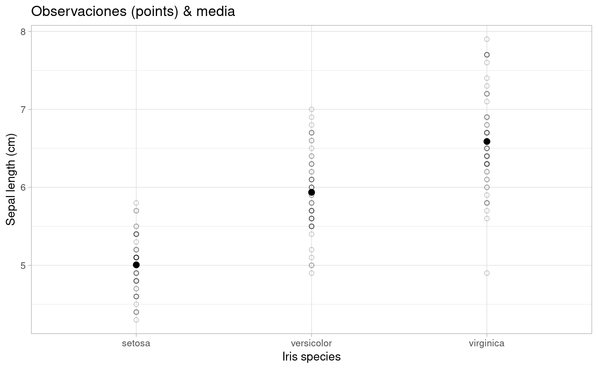


```r
p2 <- p0 + 
  geom_jitter(width = 0.2, alpha=0.2)+
  stat_summary(fun = mean,  #median
               fun.min= mean,
               fun.max = mean,
               geom = "crossbar", 
               size = 0.5)+
  ggtitle("Observaciones (jitter) & media")
p2
```

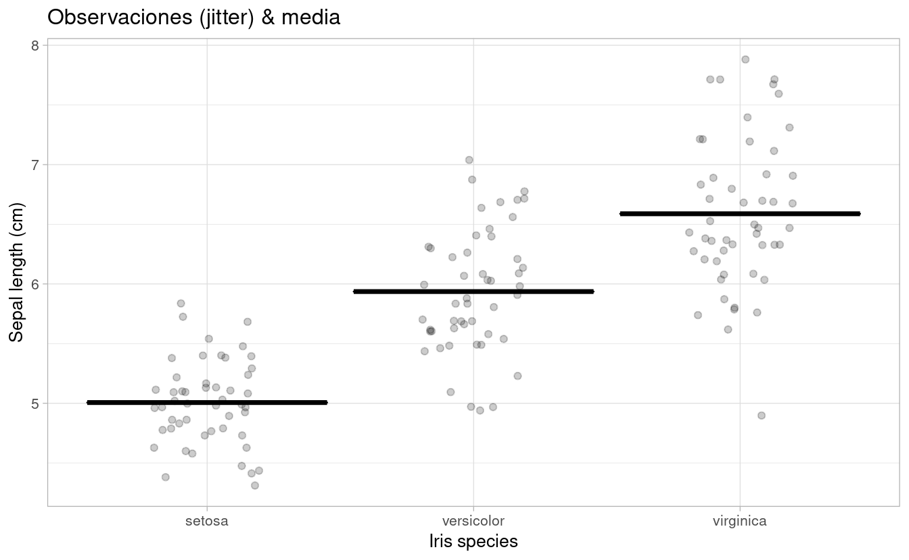


### Barplot + SE


```r
p3 <-p0 + 
  # geom_bar(stat="identity") +
  stat_summary(fun=mean, position=position_dodge(width=0.95),geom="bar",
               colour="black",fill="grey90")+
  stat_summary(fun.data=mean_cl_normal, geom="errorbar", width=0.2) + 
ggtitle("Barplot & SEM")
  # geom_text(data= let, aes(label = M, x= trt, y=1, hjust=0.5),size = 4)
p3
```

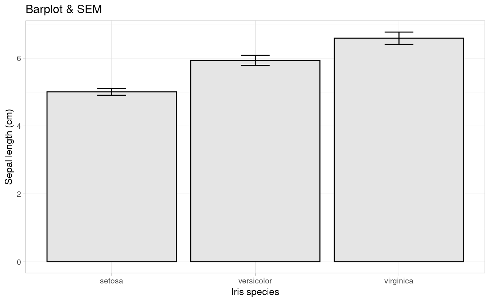

### Box-plot 


```r
p4 <-p0 + 
  geom_boxplot(fill = "grey90") +
  ggtitle("Boxplot & mean") 
p4
```

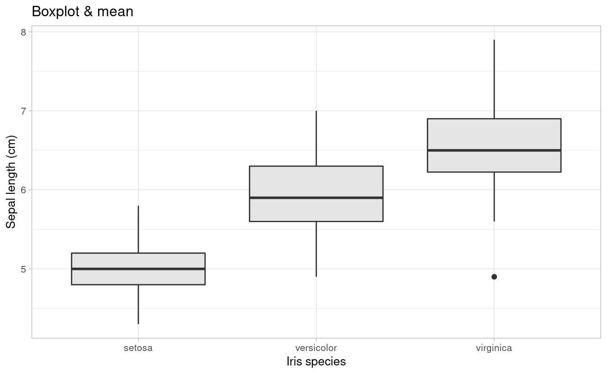

### Violin plot


```r
p5 <-p0 + 
  geom_violin(trim=FALSE,fill = "grey90")+
  ggtitle("Violin plot")
p5 
```

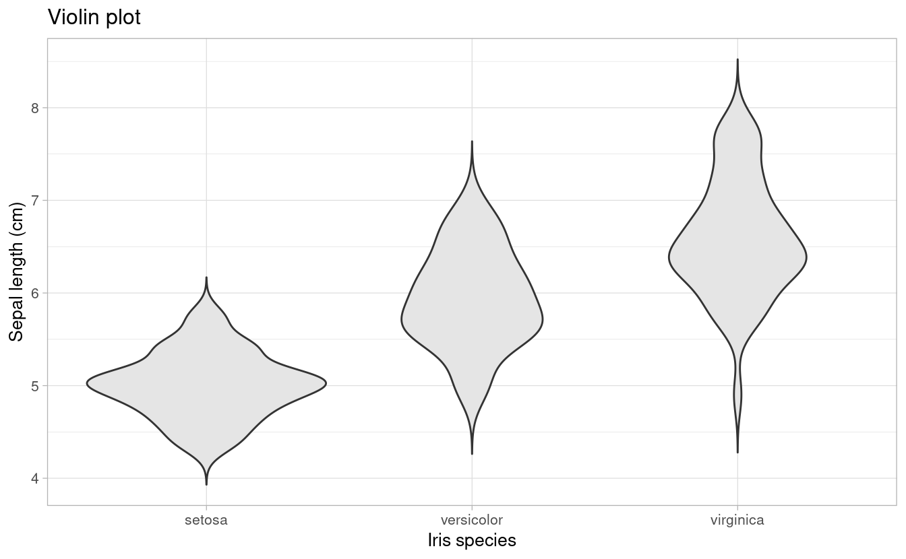

### Media & dispersión


```r
p6 <-p0 + 
  stat_summary(fun="mean", geom="point", size=2)+
  stat_summary(fun.data = mean_se, geom = "errorbar", width=0.2)+
  stat_summary(fun.data= mean_sdl, geom = "errorbar", color="red", width=0.2)+
  stat_summary(fun.data = mean_cl_boot, geom = "errorbar", color="blue", width=0.2)+
  ggtitle("Media + SE (negro) / SD (rojo) / 95% CI (negro)")
p6
```

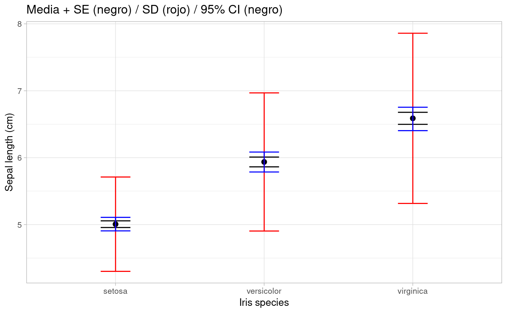


```r
cowplot::plot_grid(p1, p2, p3, p4, p5, p6, ncol = 3, nrow = 2)
```

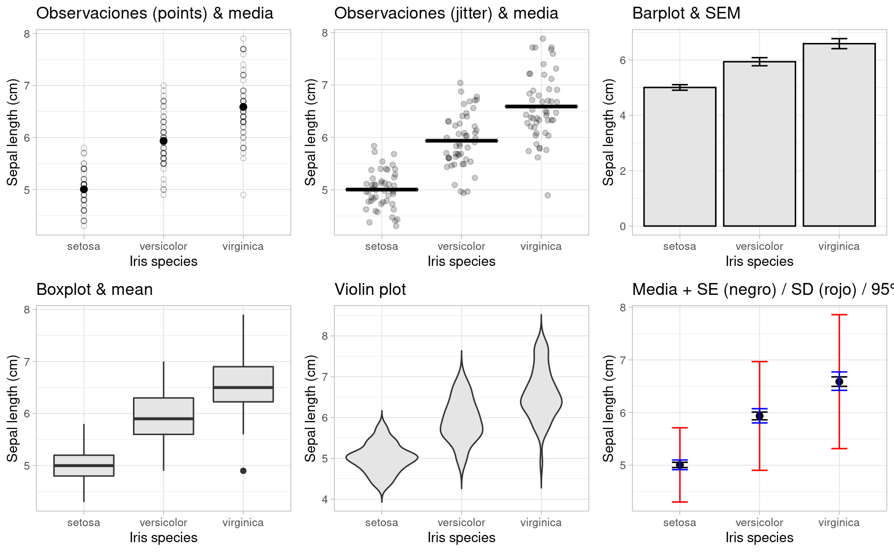
