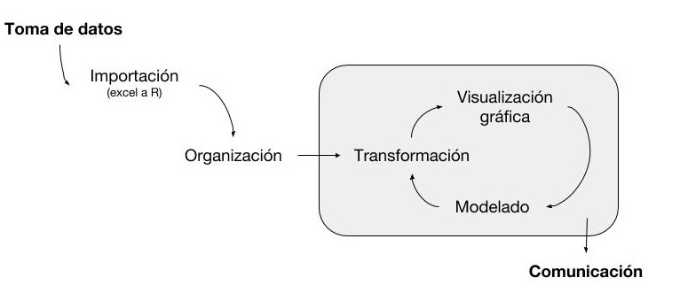
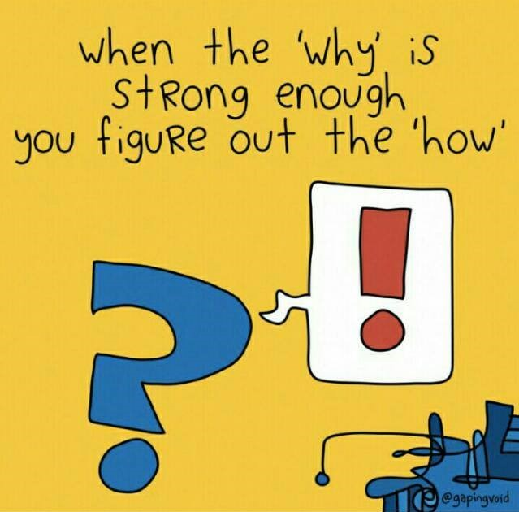

--- 
title: "Introducción a R para el análisis de datos de Ciencias Agrarias"
author: ""
site: bookdown::bookdown_site
output: bookdown::gitbook
documentclass: book
bibliography: [book.bib, packages.bib]
biblio-style: apalike
link-citations: yes
github-repo: juanchiem/R_Intro
---

```{r include=FALSE}
library(knitr)
opts_chunk$set(echo = TRUE, 
                      warning = FALSE, 
                      message = FALSE, 
                      eval=FALSE, 
                      fig.width = 12,
                      fig.height = 8)

options(width = 90)
```

# Motivación {-}

*"Una de las cosas más importantes que puedes hacer es dedicar un tiempo para aprender un lenguaje de programación. Aprender a programar es como aprender otro idioma: requiere tiempo y entrenamiento, y no hay resultados prácticos inmediatos. Pero si superas esa primera subida empinada de la curva de aprendizaje, las ganancias como científico son enormes. Programar no sólo te liberará de la camisa de fuerza de los softwares estadísticos cerrados, sino que también agudizará tus habilidades analíticas y ampliará los horizontes de modelado ecológico y estadístico.”*

 

<div style="text-align: right">  ~ Adaptación de [@ellison2004primer] ~ </div>

<hr>

Podríamos resumir nuestro trabajo como científicos, desde la recolección de datos en el campo, hasta su divulgación a través del siguiente esquema:

 

<div style="text-align: right">  ~ Adaptación de "R for Data Science" [@wickham2016r] ~ </div>

</br>


<hr>

### Objetivos {-}

El curso pretende proveer herramientas de programación básicas para llevar adelante el proceso de investigación tomando como base el esquema de trabajo anterior. Para ello, usaremos datos (reales o simulados) típicos del área de Ciencias Agrarias. Importante: i) no es un curso de estadística; ii) entendemos la programación como un simple medio para optimizar nuestra labor cotidiana (no como un fin mismo), al final del día seguiremos siendo fitopatólogos, fisiólogos,  bioquímicos, etc.; y iii) maximizaremos la adopción de la filosofia [tidyverse](https://www.tidyverse.org/) 

<hr>

<div style="text-align: center">
<b>Estas son algunas razones por la que elegimos R</b> [@R-base]
</div>


```{block, type='boxed'}
 1. Software libre

  2. Aprender un lenguaje de programación: ejercicio mental/lógica. Aprender estadística resulta mucho mas ameno.

  3. Software actualizado y con una amplia gama de paquetes específicos (drc, agricolae, epiphy…)

  4. Gran flexibilidad y elegancia de los gráficos

  5. Comunidad activa y creciente dispuesta a ayudar (aprendemos a usar terminos técnicos de data science en inglés)


```
</br>

<div style="text-align: center"> </div>

</br>

### Cronograma {-}


|Horario             |Lunes           |Martes             |Miércoles        |Jueves               |Viernes      |
|:-------------------|:---------------|:------------------|:----------------|:--------------------|:------------|
|9:00     (10.30)    12.30  |Intro R RStudio |Importar Manipular |Modelos lineales |Gráficos II Reportes |        |
|13.30    (15:00)    16:00 |Rcalc  Objetos  |Explorar           |Modelos lineales |                 |Presentación de reportes|

</br>

### Autor {-}

* Juan Pablo Edwards Molina: Investigador - Epidemiología de enfermedades de cultivos (IPAVE / INTA).
    + Email: [edwardsmolina@gmail.com](mailto:edwardsmolina@gmail.com)
    + ORCID: <https://orcid.org/0000-0002-3685-760X>
    + Twitter: [juanchiedwards](https://twitter.com/juanchiedwards)
    + GitHub: <https://github.com/juanchiem>

<b>Colaboradores</b> 

* Mauro Paccioretti: Becario en Fitopatologia, doctorando - IPAVE / INTA.
    + Email: [mauropaccioretti@gmail.com](mailto:mauropaccioretti@gmail.com)
    + Twitter: [mauropaccioretti](https://www.instagram.com/mauropaccioretti)

* Pablo Paccioretti: Becario Conicet, doctorando - Depto. de Estadistica y Biometria / UNC. 
    + Email: [pablopaccioretti@gmail.com](mailto:pablopaccioretti@gmail.com)

</br>

<a rel="license" href="http://creativecommons.org/licenses/by-nc-nd/4.0/"></a><br />Este obra está licenciado com uma Licença <a rel="license" href="http://creativecommons.org/licenses/by-nc-nd/4.0/">Creative Commons Atribuição-NãoComercial-SemDerivações 4.0 Internacional</a>.

</br>
