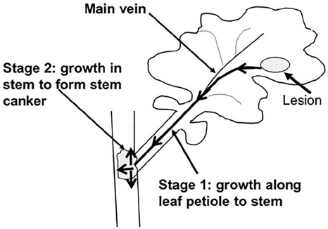

```{r include=FALSE}
knitr::opts_chunk$set(echo = TRUE, 
                      warning = FALSE, 
                      message = FALSE, 
                      fig.width = 10,
                      fig.height = 7)
options(width = 90)

library(tidyverse)

```

## Phoma en colza

"can_phoma" es el dataset de un experimento de colza (*Brassica napus*) donde fueron testeados 10 fungicidas (mas un control sin protección con fungicida) con 3 bloques en que se registró el progreso de manchas foliares de Phoma lingam a través del tiempo (tiempo térmico desde la detección de la primera mancha). La unidad experimental está identificada en la variable "par" la que contiene la información del bloque (1° dígito), y tratamiento (2°-3° digitos).

</br>




1 - Importación de datos (desde internet - googlesheets)

```{r}
library(gsheet)

url1="https://docs.google.com/spreadsheets/d/135CDYxoU9KF-Gl32461EWpX0LlXbsSGZ4t_i-0VPpko/edit?usp=sharing"

# browseURL(url1)
can_phoma = gsheet2tbl(url1)

can_phoma
# str(can_phoma)
```

Esto seria uma forma "wide" de representación del dataset (crudo).

Para analizar el efecto del tratamiento fungicida necesitamos calcular el área bajo la curva (AUC) del progreso de la enfermedad. Para esto vamos a transponer can_phoma al formato "long". La función gather (del inglés "reunir", paquete tidyr) apila las columnas que indiquemos.

2 - Manipulación + transformación

Crearemos una variable "tt" con los nombres de las columnas con números, y otra "inc" (incidencia) con los valores correspondientes:

```{r}
can_long <- can_phoma %>% 
  gather(`015`, `058`, `095`, `146`, `165`, `180`, `248`, 
         key = "tt", value = "inc") 
can_long
# str(can_long)
```

Precisamos que tt sea clase "numérica" para ciertos cálculos

```{r}
can_long$tt <- as.numeric(can_long$tt)
can_long$tt
can_long <- can_long %>% arrange(plot)
str(can_long)
```

Exploramos las evaluaciones originales con gráfico de puntos + líneas individualizando cada parcela en un panel.

```{r}
ggplot(can_long, aes(x=tt, y=inc)) +
  geom_point() +
  geom_line(aes(group=plot)) +
  facet_grid(bk~trt)
```

Verificamos la presencia de errores de tipeo en dos parcelas: 202 y 310. (editamos el dataset original)

```{r, eval=FALSE}
# editar los datos:
can_long<- edit(can_long)
```

Calculamos un valor de AUC por parcela con auxilio de las funciones `group_by` + `summarize` y `agricolae::audpc`

```{r}
# Funcion na.omit
can_auc <- na.omit(can_long) %>% 
  group_by(trt, bk, sev_cank) %>% 
  summarise(auc_i = agricolae::audpc (inc, tt))
can_auc
```

- Exploramos la variable transformada `auc_p` con boxplot

```{r}
ggplot(can_auc, aes(x=factor(trt), y=auc_i)) +
  geom_boxplot()
```

- Exploramos la variable original `sev_cank` con boxplot

```{r}
ggplot(can_auc, aes(x=factor(trt), y=sev_cank)) +
  geom_boxplot()
```

Ahora si, can_phoma está listo para entrar al próximo paso: modelado.
